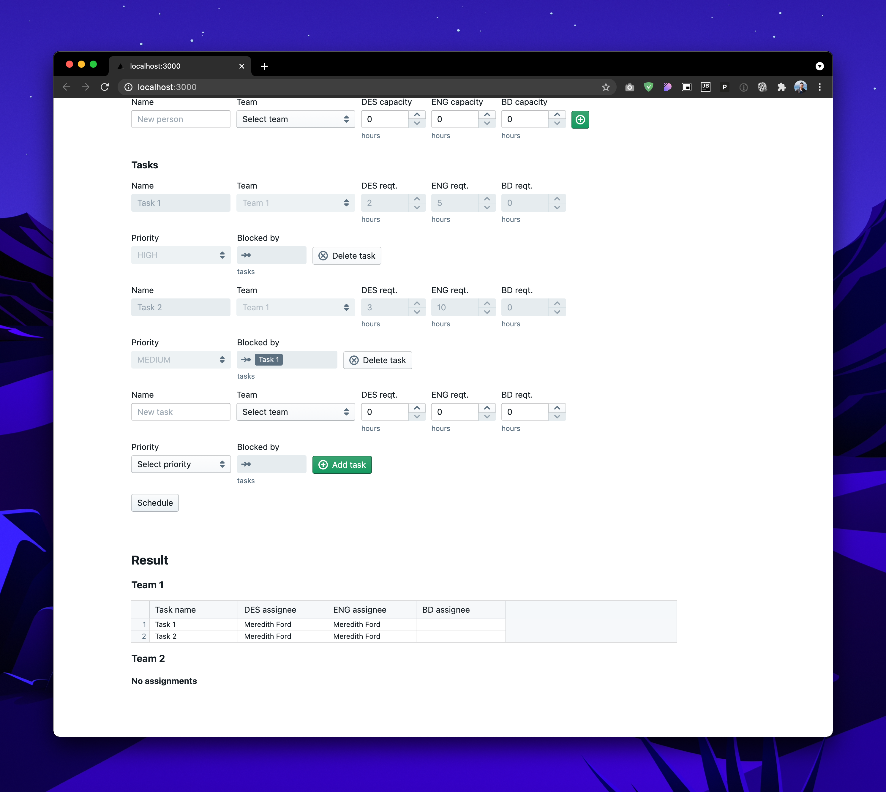

# cis189-project

## Setting up the environment
### `engine`
From wd `./engine`, run `pipenv install`.

### `web`
From wd `./web`, run `npm install` or `yarn`.

## Running the app
### With GUI
From wd `./web`, run `npm run dev` or `yarn dev`.

